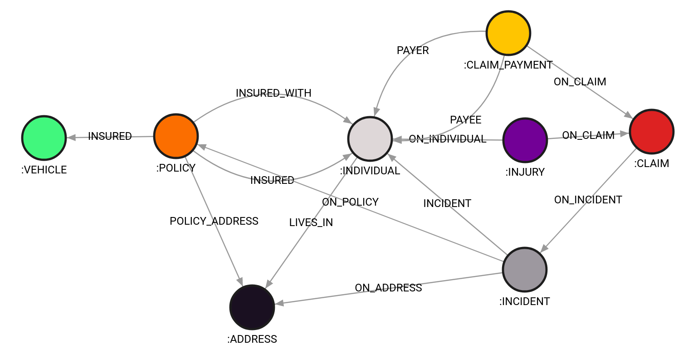

<h1 align="center">
 Insurance Fraud Detection Demo
</h1>

<p align="center">
  <a href="https://github.com/memgraph/insurance-fraud/blob/master/LICENSE">
    
  </a>
  <a href="https://github.com/memgraph/insurance-fraud">
    
  </a>
</p>

<p align="center">
  <a href="https://twitter.com/intent/follow?screen_name=memgraphdb">
    
  </a>
  <a href="https://memgr.ph/join-discord">
    
  </a>
</p>

A demo modeling Insurance data, individuals along with their policies, claims, and incidents. Using Memgraph, utilizes the power of graphs to model the data and detect fraudulent claims. Extracts features using graph algorithms and uses machine learning to evaluate insurance claims.

## Data model
<p align="left">
  
</p>


## Running the demo

You can set up the project with poetry:
```
poetry install
```

Or, if you don't want to use poetry, simply:
```
pip install -r requirements.txt
```

The demo is located in `./fraud_detection_demo.ipynb`. 

Recommended Python version is 3.9, since `sklearn` package doesn't yet support Python 3.10.

## Using the dataset only

If you want to just use the dataset, try running:
```
python dataset/data_generator.py 1000 300
```
And to import it into Memgraph, first start Memgraph, and then run the load script:
```
docker run -it -p 7687:7687 -p 3000:3000 memgraph/memgraph-platform

python load_demo_dataset.py 
```
